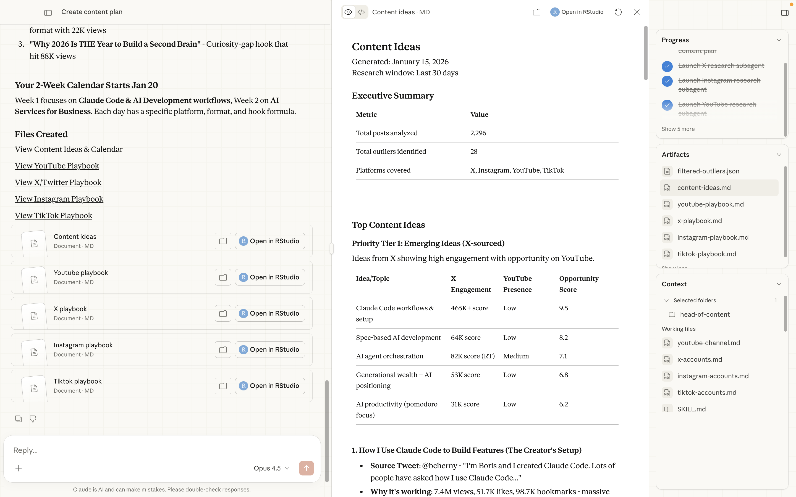

# Claude Cowork - Head of Content
> Your AI-powered content research coworker. Stop guessing what content works—let Claude research, analyze, and surface winning patterns across X/Twitter, Instagram, YouTube, and TikTok.
>
> Check out this [YouTube video](https://www.youtube.com/@bradbonanno) where we walk through setting up and using Head of Content.



A [Claude Cowork](https://docs.anthropic.com/en/docs/claude-code/claude-cowork) skill set that automates social media content research—identifying high-performing content, analyzing viral patterns with AI, and generating actionable content strategies.

## Get Your API Keys

| Service | What It Powers | Sign Up |
|---------|----------------|---------|
| **Apify** | X/Twitter, Instagram, TikTok scraping | [Sign up for Apify](https://console.apify.com/?fpr=ih20xe) |
| **TubeLab** | YouTube outlier detection | [Sign up for TubeLab](https://tubelab.net/?ref=brad) |

## What This Does

- **Research high-performing content** across 4 major platforms
- **Identify statistical outliers** using engagement scoring algorithms
- **Analyze videos with AI** to extract hooks, structure, and replicable patterns
- **Generate content plans** with cross-platform opportunity scoring
- **Create platform playbooks** with specific recommendations

## Prerequisites

- **macOS** (required for Claude CoWork)
- **Claude Max Plan** (required for custom skills)
- **Claude Desktop** installed
- **Python 3.8+** with pip

---

## Quick Start

### 1. Clone the Repository

```bash
git clone https://github.com/bradautomates/head-of-content.git
cd head-of-content
```

### 2. Set Up Your Environment

Copy the example environment file and add your API keys (see [API Keys Setup](#api-keys-setup) below):

```bash
cp .env.example .env
```

Then edit `.env` with your API keys.

### 3. Open in Claude Desktop

1. Open **Claude Desktop**
2. Click the **Claude Coworker** tab the in sidebar
3. At the bottom of the panel, click **Work in a folder**
4. Select your `head-of-content` folder

### 4. Install the Skills

The repository includes 6 `.skill` files that need to be added to Claude Desktop:

1. In Claude Desktop, go to **Settings** (gear icon)
2. Click **Capabilities**
3. Click **Skills**
4. Click **Add Skill**
5. Upload each `.skill` file from your `head-of-content` folder:
   - `x-research.skill`
   - `instagram-research.skill`
   - `youtube-research.skill`
   - `tiktok-research.skill`
   - `video-content-analyzer.skill`
   - `content-planner.skill`

Repeat the "Add Skill" process for each file.

---

## API Keys Setup

This repository requires 3 API keys.

### Apify (X/Twitter, Instagram, TikTok)

Apify powers the social media scraping for X, Instagram, and TikTok.

**Actors used:**
- [Tweet Scraper V2](https://apify.com/apidojo/tweet-scraper?fpr=ih20xe) - X/Twitter posts and profiles
- [Instagram Scraper](https://apify.com/apify/instagram-scraper?fpr=ih20xe) - Instagram posts and reels
- [TikTok Scraper](https://apify.com/clockworks/tiktok-scraper?fpr=ih20xe) - TikTok videos and profiles

**Setup:**
1. Go to [console.apify.com](https://console.apify.com/?fpr=ih20xe)
2. Click **Sign Up** (A paid subscription is required for the X scraper to function as expected)
3. After signing in, go to **Settings** > **Integrations**
4. Copy your **Personal API Token**

**Cost:** Free tier includes $5/month. Research runs typically cost $0.10-$0.50 depending on volume.

### TubeLab (YouTube)

TubeLab provides YouTube outlier detection and video intelligence.

**APIs used:**
- [Outliers API](https://tubelab.net/docs/api/reference/search-outliers?ref=brad) - Find viral videos in any niche
- [Transcripts API](https://tubelab.net/docs/api/reference/get-video-transcript?ref=brad) - Get video transcripts

**Setup:**
1. Go to [tubelab.net](https://tubelab.net/?ref=brad)
2. Click **Sign Up** and create an account
3. Go to **Settings** > **API** (or visit [tubelab.net/settings/api](https://tubelab.net/settings/api?ref=brad))
4. Generate and copy your **API Key**

**Cost:** Free tier available. Paid plans start at ~$29/month for higher limits.

### Google Gemini (Video Analysis)

Gemini AI analyzes video content to extract hooks, patterns, and structure.

1. Go to [aistudio.google.com](https://aistudio.google.com/)
2. Sign in with your Google account
3. Click **Get API Key** (or visit [aistudio.google.com/apikey](https://aistudio.google.com/apikey))
4. Click **Create API Key** and copy it

**Cost:** Free tier includes 60 requests/minute. More than enough for research.

---

## Environment Setup

### Create Your .env File

Copy the example environment file:

```bash
cp .env.example .env
```

Open `.env` in your editor and add your API keys:

```bash
# YouTube Research - TubeLab API
TUBELAB_API_KEY=your-tubelab-api-key-here

# X/Twitter, Instagram, TikTok Research - Apify API
APIFY_TOKEN=your-apify-token-here

# Video Analysis - Gemini API
GEMINI_API_KEY=your-gemini-api-key-here
```

### Verify Setup

Test that your environment is configured correctly:

```bash
# Load environment variables
export $(cat .env | grep -v '^#' | xargs)

# Verify they're set
echo "Apify: ${APIFY_TOKEN:0:10}..."
echo "TubeLab: ${TUBELAB_API_KEY:0:10}..."
echo "Gemini: ${GEMINI_API_KEY:0:10}..."
```

---

## Configure Your Research Targets

Before running research, configure which accounts to track in `.claude/context/`:

### X/Twitter Accounts

Edit `.claude/context/x-accounts.md`:

```markdown
# X/Twitter Accounts to Track

| Username | Niche | Notes |
|----------|-------|-------|
| @levelsio | indie hacking | bootstrapped founder, viral tweets |
| @naval | philosophy/startups | high engagement threads |
| @sahaborhani | AI/tech | technical content |
```

### Instagram Accounts

Edit `.claude/context/instagram-accounts.md`:

```markdown
# Instagram Accounts to Track

| Username | Niche | Notes |
|----------|-------|-------|
| @garyvee | marketing | high volume, reels focus |
| @hormozi | business | educational content |
```

### TikTok Accounts

Edit `.claude/context/tiktok-accounts.md`:

```markdown
# TikTok Accounts to Track

| Username | Niche | Notes |
|----------|-------|-------|
| @garyvee | marketing | cross-platform content |
| @tiktokcreators | meta/tips | platform trends |
```

### YouTube Channel (Your Channel)

Edit `.claude/context/youtube-channel.md` with your channel info:

```markdown
# YouTube Channel Context

## Channel Information
- **Channel Name:** Your Channel Name
- **Channel Handle:** @yourhandle
- **Channel ID:** UCxxxxxxxxxxxxxxxxxx

## Niche & Positioning
- **Primary Niche:** Your niche
- **Content Style:** Your style
- **Target Audience:** Your audience

## Content Strategy
- **Typical Video Length:** 10-20mins
- **Upload Frequency:** Weekly
- **Best Performing Topics:** Your best topics

## Goals
- **Growth Targets:** Your subscriber goal
- **Content Goals:** Your content goals
```
---

## Available Skills

Once connected, these skills are available in Claude Desktop:

| Command | Description |
|---------|-------------|
| `/x-research` | Research X/Twitter content |
| `/instagram-research` | Research Instagram reels and posts |
| `/youtube-research` | Find YouTube outliers in your niche |
| `/tiktok-research` | Research TikTok videos |
| `/content-planner` | Run all research + create content plan |

Type `/` in the chat to see all available skills.

---

## Usage

### Run Individual Platform Research

In Claude Desktop, simply invoke the skill:

```
Run x-research
```

This will:
1. Fetch recent content from your tracked accounts
2. Calculate engagement scores and identify outliers
3. Analyze top videos with AI (if applicable)
4. Generate a report in `x-research/YYYY-MM-DD_HHMMSS/`

### Run Full Content Planning

For comprehensive cross-platform research:

```
Run content-planner
```

This will:
1. Run all 4 platform research skills in parallel
2. Aggregate findings across platforms
3. Identify cross-platform content opportunities
4. Generate platform-specific playbooks
5. Output everything to `content-plans/YYYY-MM-DD_HHMMSS/`

### Natural Language

You can also just ask Claude:

- "Research what's performing on X right now"
- "Find trending content in my Instagram niche"
- "Create a content plan for next week"
- "What videos are going viral on TikTok?"

---

## Output Structure

### Platform Research Output

Each research run creates a timestamped folder:

```
x-research/2024-01-15_143022/
├── raw.json            # Raw API data
├── outliers.json       # Identified outliers with metrics
├── video-analysis.json # AI-extracted patterns (if videos)
└── report.md           # Human-readable summary
```

### Content Plan Output

```
content-plans/2024-01-15_143022/
├── content-ideas.md       # Cross-platform content opportunities
├── x-playbook.md          # X/Twitter specific intelligence
├── instagram-playbook.md  # Instagram specific intelligence
├── youtube-playbook.md    # YouTube specific intelligence
└── tiktok-playbook.md     # TikTok specific intelligence
```

---

## Engagement Scoring

Each platform uses optimized engagement weights:

### X/Twitter
| Signal | Weight | Why |
|--------|--------|-----|
| Bookmarks | 4x | Strongest intent signal |
| Replies | 3x | Conversation starter |
| Retweets | 2x | Amplification |
| Quotes | 2x | Commentary |
| Likes | 1x | Passive approval |

### Instagram
```
engagement = likes + (3 × comments) + (0.1 × views)
```

### TikTok
```
engagement = likes + (3 × comments) + (2 × shares) + (2 × saves) + (0.05 × views)
```

### YouTube
```
score = zScore × recency_boost  (5% daily decay)
```

**Outlier threshold:** Content scoring above `mean + (2.0 × std_dev)` is flagged as an outlier.

---

## Troubleshooting

### "API key not found" errors

```bash
# Make sure .env exists and has your keys
cat .env

# Load environment variables before running
export $(cat .env | grep -v '^#' | xargs)
```

### "No accounts configured" warnings

Make sure you've added accounts to track in `.claude/context/`:
- `x-accounts.md`
- `instagram-accounts.md`
- `tiktok-accounts.md`

### Cowork not showing in Claude Desktop

1. Verify you're on the **Claude Max plan**
2. Update and restart Claude Desktop

### Apify rate limits

The free Apify tier has usage limits. If you hit them:
- Reduce the number of accounts tracked
- Increase time between research runs
- Consider upgrading your Apify plan

---

## License

MIT License - Feel free to modify and distribute.

---

## Contributing

Contributions welcome! To add new skills or improve existing ones:

1. Fork the repository
2. Use `/skill-creator` to scaffold new skills
3. Follow the patterns in existing skills
4. Submit a pull request

---

## Implement AI in Your Business
> Practical AI implementation for real business results

Learn how to implement AI tools and workflows that actually move the needle for your business on my [YouTube channel](https://www.youtube.com/@bradbonanno).

Follow [@corpcowboy_](https://x.com/corpcowboy_) on X